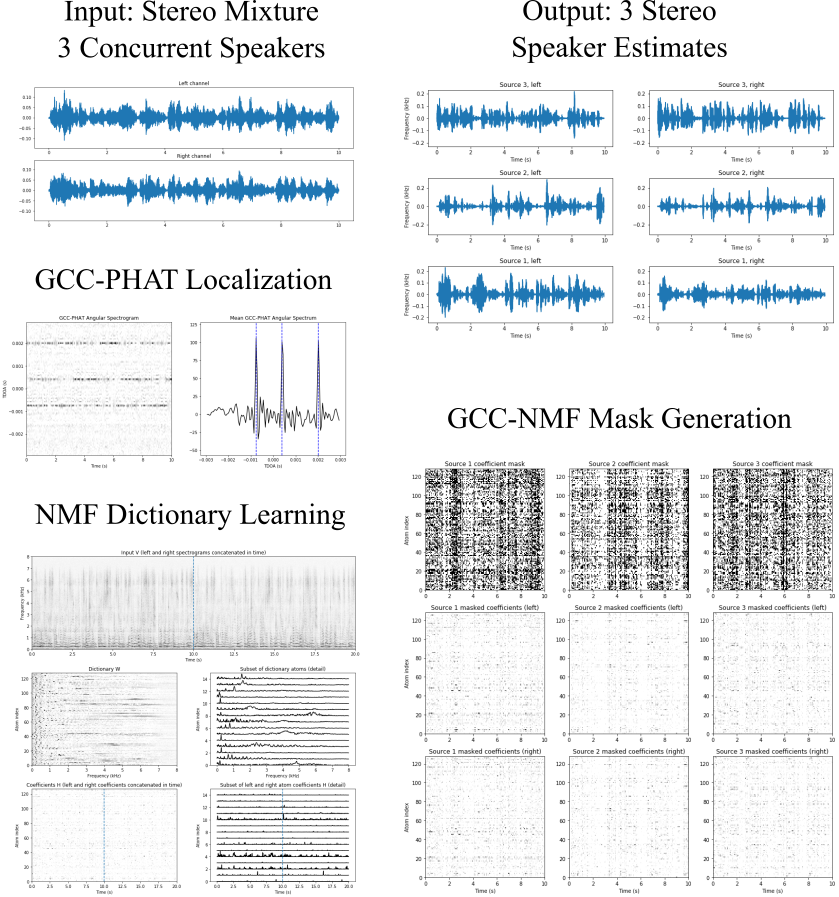
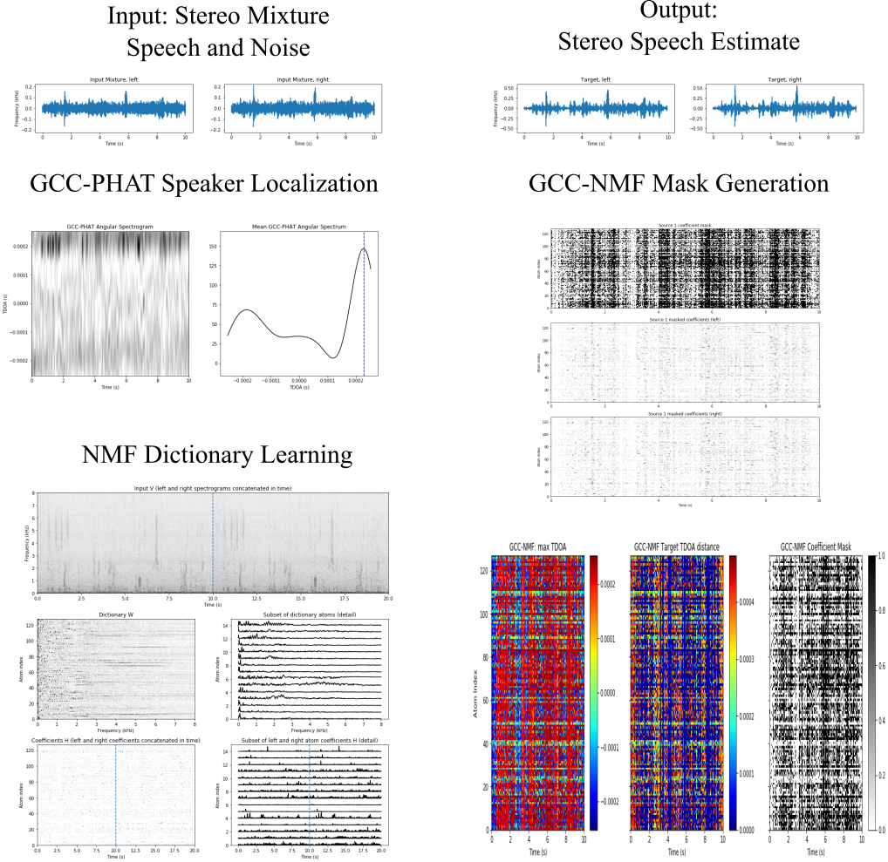

<!---
The MIT License (MIT)

Copyright (c) 2016 Sean UN Wood

Permission is hereby granted, free of charge, to any person obtaining a copy
of this software and associated documentation files (the "Software"), to deal
in the Software without restriction, including without limitation the rights
to use, copy, modify, merge, publish, distribute, sublicense, and/or sell
copies of the Software, and to permit persons to whom the Software is
furnished to do so, subject to the following conditions:

The above copyright notice and this permission notice shall be included in all
copies or substantial portions of the Software.

THE SOFTWARE IS PROVIDED "AS IS", WITHOUT WARRANTY OF ANY KIND, EXPRESS OR
IMPLIED, INCLUDING BUT NOT LIMITED TO THE WARRANTIES OF MERCHANTABILITY,
FITNESS FOR A PARTICULAR PURPOSE AND NONINFRINGEMENT. IN NO EVENT SHALL THE
AUTHORS OR COPYRIGHT HOLDERS BE LIABLE FOR ANY CLAIM, DAMAGES OR OTHER
LIABILITY, WHETHER IN AN ACTION OF CONTRACT, TORT OR OTHERWISE, ARISING FROM,
OUT OF OR IN CONNECTION WITH THE SOFTWARE OR THE USE OR OTHER DEALINGS IN THE
SOFTWARE.
--->

# GCC-NMF
GCC-NMF is a blind source separation algorithm that combines the [GCC](http://ieeexplore.ieee.org/abstract/document/1162830/) spatial localization method with the [NMF](https://en.wikipedia.org/wiki/Non-negative_matrix_factorization) unsupervised dictionary learning algorithm. GCC-NMF has been applied to stereo speech separation and enhancement in both offline and real-time settings, though it is a generic source separation algorithm and could be applicable to other types of signals.
This GitHub repository is home to open source demonstrations of the following papers,

- Sean UN Wood and Jean Rouat, [*Speech Separation with GCC-NMF*](http://www.isca-speech.org/archive/Interspeech_2016/pdfs/1449.PDF), **Interspeech 2016**.  
DOI: [10.21437/Interspeech.2016-1449](http://dx.doi.org/10.21437/Interspeech.2016-1449)
- Sean UN Wood, Jean Rouat, Stéphane Dupont, Gueorgui Pironkov, [*Speech Separation and Enhancement with GCC-NMF*](https://www.gel.usherbrooke.ca/rouat/publications/IEEE_ACMTrGCCNMFWoodRouat2017.pdf), **IEEE/ACM Transactions on Audio, Speech, and Language Processing**, vol. 25, no. 4, pp. 745–755, 2017.  
DOI: [10.1109/TASLP.2017.2656805](https://doi.org/10.1109/TASLP.2017.2656805)
- Sean UN Wood and Jean Rouat, [*Real-time Speech Enhancement with GCC-NMF*](https://www.researchgate.net/profile/Sean_Wood7/publication/318511757_Real-time_Speech_Enhancement_with_GCC-NMF/links/596ea657a6fdcc2416901891/Real-time-Speech-Enhancement-with-GCC-NMF.pdf), **Interspeech 2017**.

in the form of **iPython Notebooks**:

- [Offline Speech Separation](https://nbviewer.jupyter.org/github/seanwood/gcc-nmf/blob/master/notebooks/offlineSpeechSeparation.ipynb)
- [Offline Speech Enhancement](https://nbviewer.jupyter.org/github/seanwood/gcc-nmf/blob/master/notebooks/offlineSpeechEnhancement.ipynb)
- [Online Speech Separation](#Online-Speech-Enhancement)
  
## Offline Speech Separation

The [Offline Speech Separation iPython notebook](https://nbviewer.jupyter.org/github/seanwood/gcc-nmf/blob/master/notebooks/offlineSpeechSeparation.ipynb) shows how GCC-NMF can be used to separate multiple concurrent speakers in an offline fashion. The NMF dictionary is first learned directly from the mixture signal, and sources are subsequently separated by attributing each atom at each time to a single source based on the dictionary atoms' estimated time delay of arrival (TDOA). Source localization is achieved with GCC-PHAT.

## Offline Speech Enhancement

The [Offline Speech Enhancement iPython notebook](https://nbviewer.jupyter.org/github/seanwood/gcc-nmf/blob/master/notebooks/offlineSpeechEnhancement.ipynb) demonstrates how GCC-NMF can can be used for offline speech enhancement, where instead of multiple speakers, we have a single speaker plus noise. In this case, individual atoms are attributed either to the speaker or to noise at each point in time base on the the atom TDOAs as above. The target speaker is again localized with GCC-PHAT.

## Online Speech Enhancement
The [Online Speech Enhancement iPython notebook](https://nbviewer.jupyter.org/github/seanwood/gcc-nmf/blob/master/notebooks/onlineSpeechEnhancement.ipynb) demonstrates an online variant of GCC-NMF that works in a frame-by-frame fashion to perform speech enhancement in real-time. Here, the NMF dictionary is pre-learned from a different dataset than used at test time, NMF coefficients are inferred frame-by-frame, and speaker localization is performed with an accumulated GCC-PHAT method.